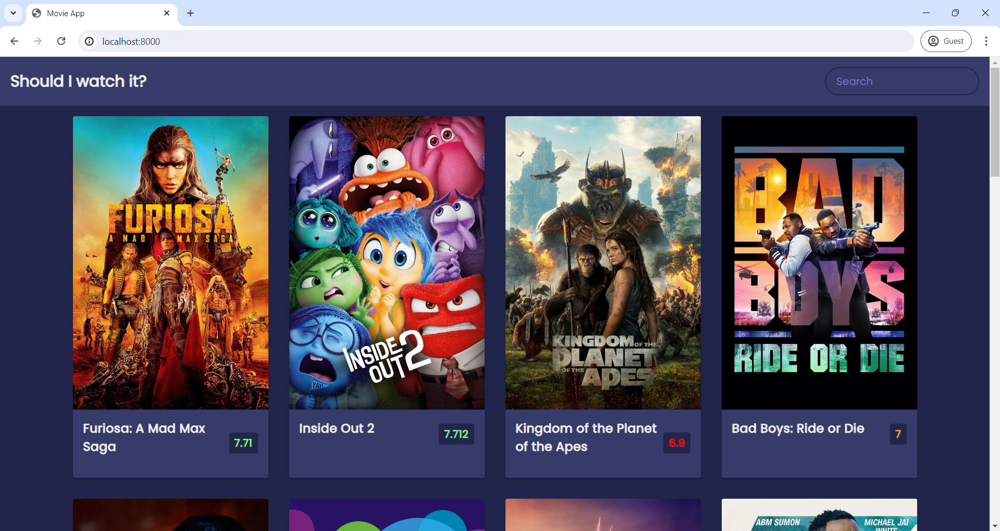

# Movies App

- This repository contains a Movies App built with HTML, CSS and JavaScript and Express. 
- The Frontend is built using HTML, CSS and JavaScript. 
- The backend uses Express to serve the front-end files.

## Features

- **Browse Movies**: Users can browse a list of movies.
- **Movie Details**: View detailed information about each movie with ratings.
- **Search Functionality**: Search for movies by title.
- **Responsive Design**: The app is fully responsive and works on all devices.
- **API Usage**:  TMDb API is used for fetching the list of movies.

## Technology Used

- **Frontend**: HTML 5, CSS, JavaScript
- **Backend**: Express.js 
- **Code Editor**: VS Code

## Usage

#### Prerequisites

- Node.js
- npm (Node Package Manager)

#### Installation

1. Clone the repository:
   ```bash
   git clone https://github.com/your-username/movies-app.git
   cd movies-app

2. Install the dependencies:

    ```bash
    npm install

3. Running the App: 
    To run the app in development mode, use the following command:

    ```bash
    npm run dev

    The app will be available at http://localhost:8000.

## ScreenShots




